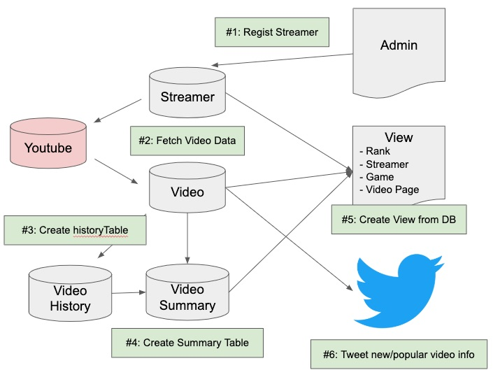

# Raptor Project ( Copy ) 
Video Platform for gamers. This is the copy of raptor project eliminating credential information such as database access. This is mainly for portfolio purpose what I have done.

# Website
This is not just tranlation. Even database itself is different between Japanese and English service.

Japanese
https://coregame.jp/

English
https://coregame.tv/

# Environment

* Python3.6
* Django
* Nginx
* Gunicorn
* Mysql
* CentOS7(VPS)

# How Raptor works? 

#### 1:Regist Streamer
Regist streamer information such as youtube channel_id from admin tool.  

#### 2:Fetch Video Data
Request to Youtube API every three hours whether new video comes up. If there is new video, fetch video data, caregorize the video and save to DB.  

#### 3:Create history table
Create video/streamer history into db every day. Track historical data for # of views, # of likes, # of subscriber etc to analyze the trend.  

#### 4:Create summary table
Create video summary table every three hours. Rating video, creating leaderboard based on last 48h views. 

#### 5:Create view from FB
Create view from existing tables. 

#### 6:Tweet new/popular video infro
Tweet on twitter once new video comes up. See examples below. This is user aquisition purpose. 
https://twitter.com/CoreGameTV_fort

